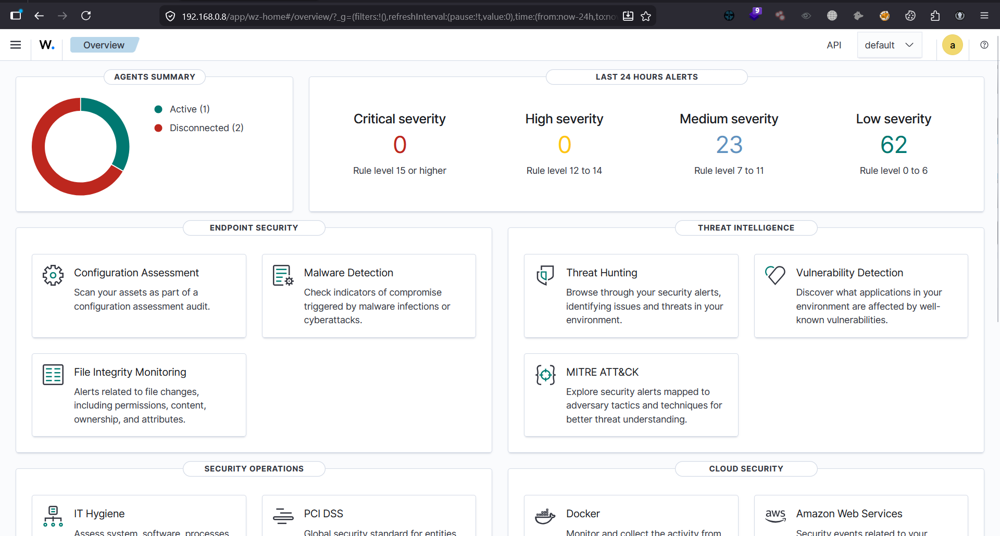
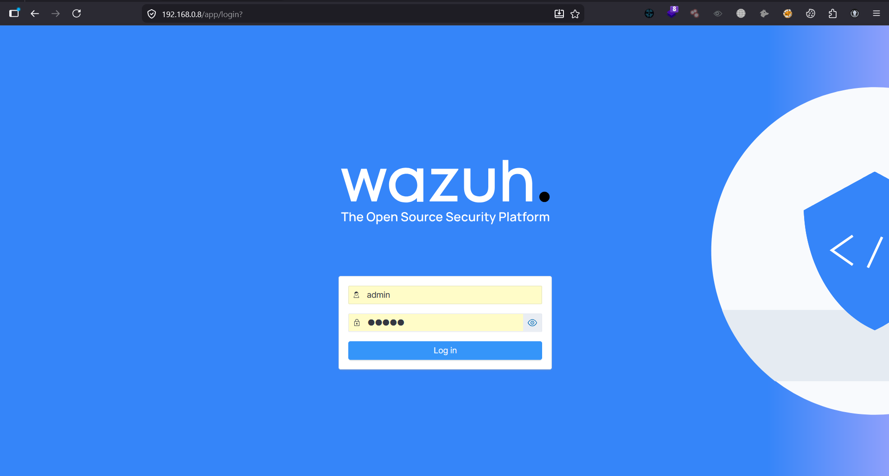
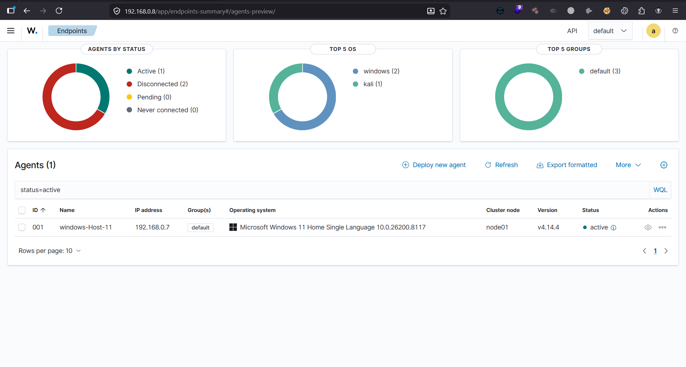

# 🛡️ SOC Home Lab – Wazuh SIEM Detection


SOC Home Lab with Wazuh SIEM for security monitoring, SSH attack detection, and log analysis across Windows and Linux systems
---

## 📌 Overview

This project demonstrates a **hands-on SOC (Security Operations Center) lab** where real-world attack scenarios were simulated and analyzed using **Wazuh SIEM**.

The focus of this lab is to detect and analyze **SSH brute-force attacks**, perform **log analysis**, and understand how alerts are generated and investigated across Windows and Linux systems.

---

## 🧭 Lab Architecture

```text
Kali Linux (Attacker)
        ↓
SSH Brute Force Attack
        ↓
Windows / Linux Targets
        ↓
Wazuh Agent → Wazuh Server → Dashboard
```

## 🖥️ Wazuh Setup
🔹 Wazuh Dashboard



🔹 Wazuh Web Interface



🔹 Wazuh Endpoints (Agents)



## 🚨 Attack Simulation – SSH Brute Force
Simulated SSH login attempts from Kali Linux
Generated multiple failed authentication logs
Observed attack detection in Wazuh SIEM
