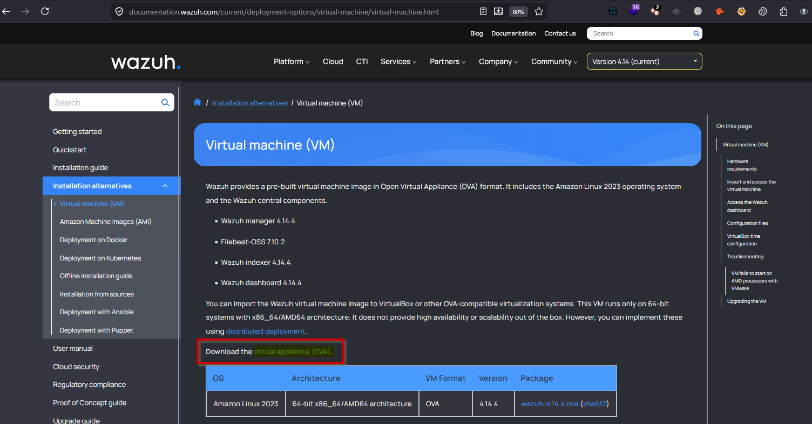
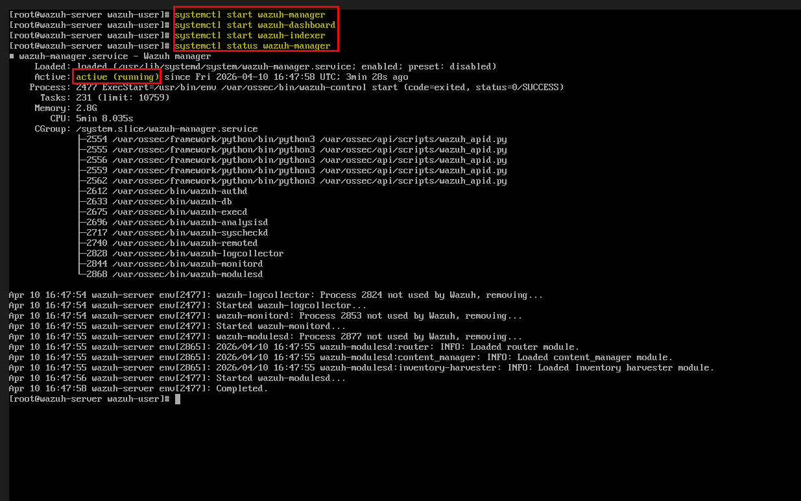
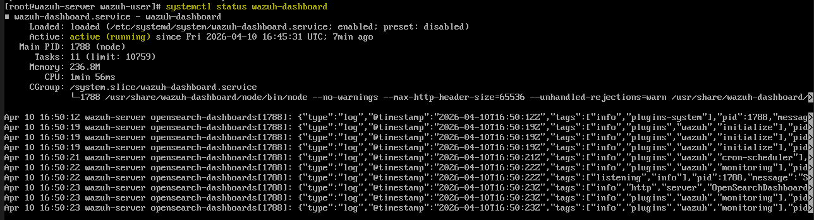
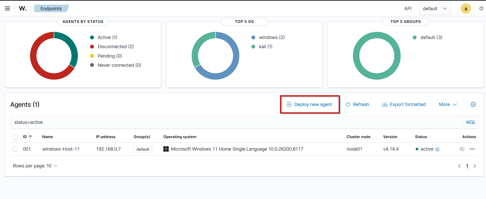
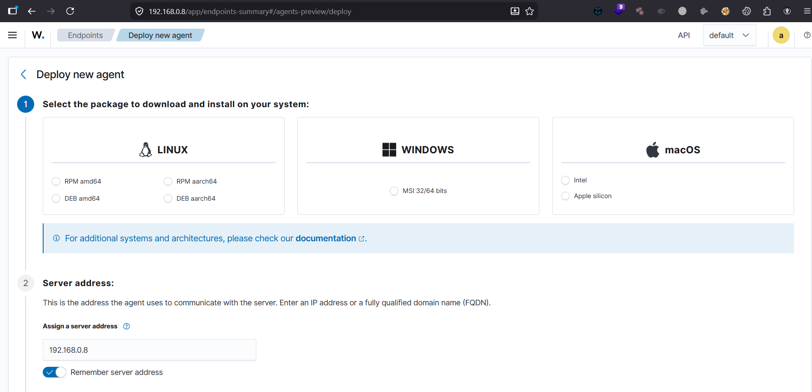
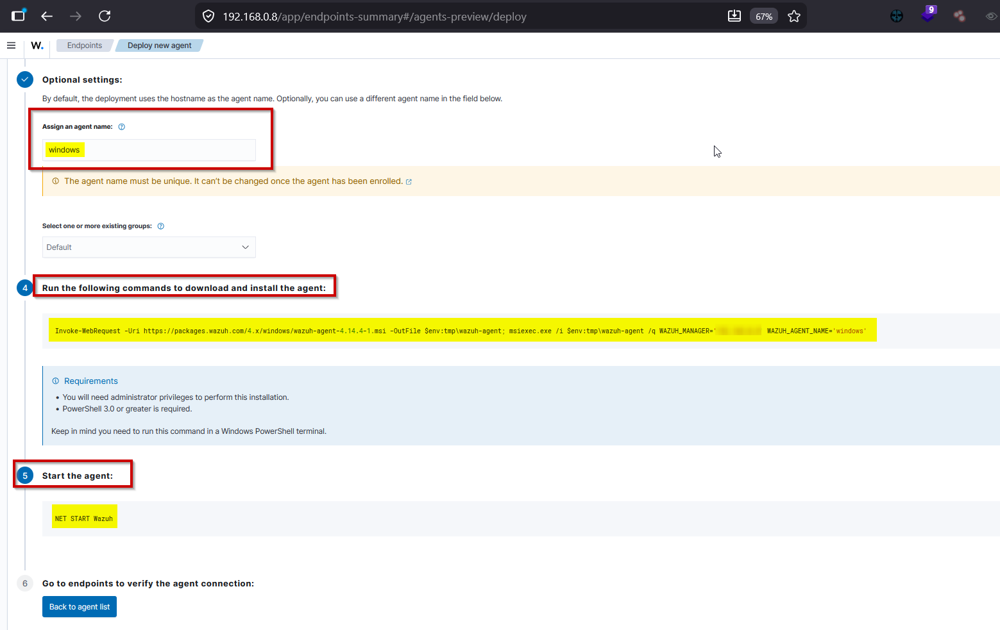

# ⚙️ SOC Lab Setup Guide – Wazuh SIEM (OVA Deployment)

This guide explains how I set up a SOC lab using the **Wazuh prebuilt OVA virtual machine** for monitoring and analyzing security events.

---

## 🖥️ 1. Lab Environment

- SIEM: Wazuh (Prebuilt OVA)
- Virtualization: VirtualBox
- Attacker Machine: Kali Linux
- Target Systems: Windows / Linux



---

## 📦 2. Import Wazuh OVA

1. Download Wazuh OVA from official website  
2. Open VirtualBox  
3. Click **File → Import Appliance**  
4. Select the `.ova` file  
5. Start the VM  





---

## 🌐 3. Access Wazuh Dashboard

- Get IP of Wazuh server:
```bash
ip a

   Open browser: https://<WAZUH-IP>

• Login using default credentials it will be always admin:admin

```
## 🔌 4. Add Agents

### Windows Agent:

#### • Install Wazuh agent on Windows machine
#### • Configure server IP
#### • Start agent service

## To select the new agent click on add new agent button as shown below & you can select the required agent OS like windows, linux or MacOS after selecting the required agent OS then give a name for the agent and then copy the given command and past that command in the agent system if you are using a windows agent the choose the powershell as admin and then past he command and the start the wazuh by using this command START WAZUH 










